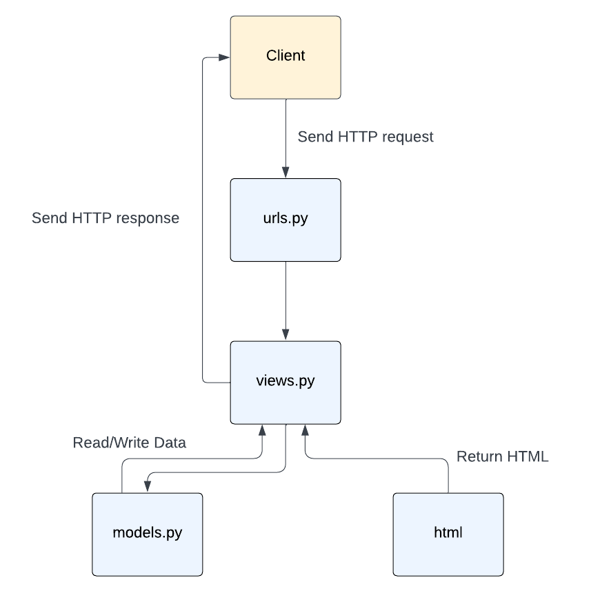

# Butter and Batter #

Patricia Herningtyas (2306152241)
PBP - A

Need some daily dose of sweetness? [Click Here](http://patricia-herningtyas-butterandbatter.pbp.cs.ui.ac.id/)

## Cara Pengimplementasian Secara Step-by-Step ##

Pertama-tama, nyalakan virtual environment.

1) Membuat sebuah proyek Django baru
    - Membuat direktori lokal baru dengan nama butter-and-batter lalu menjalankan virtual environment di dalamnya.
    - Membuat berkas requirements.txt berisikan dependencies dan menginstallnya. Setelah itu, menjalankan perintah 'django-admin startproject butter_and_batter .' yang akan membuat folder butter-and-batter berisi konfigurasi dasar untuk projek Django.
    - Menambahkan localhost ke dalam ALLOWED_HOSTS lalu menjalankan server Django pada direktori lokal.
    - Membuat repositori GitHub butter-and-batter. Setelah itu, menginisiasi direktori lokal butter-and-batter sebagai repositori Git.
    - Menambahkan file .gitignore ke dalam repositori lokal lalu mempush semua perubahan pada repositori lokal ke repositori github.
    
2) Membuat aplikasi dengan nama main pada proyek tersebut
    - Membuat aplikasi baru dengan nama main dalam direktori proyek butter_and_batter dengan menjalankan perintah 'python manage.py startapp main' yang akan membuat membuat folder main yang berisi berkas-berkas dasar untuk aplikasi Django seperti views.py, models.py, dan urls.py.
    - Membuka settings.py di folder proyek, lalu tambahkan 'main' ke dalam daftar INSTALLED_APP agar Django mengenali aplikasi baru.

3) Melakukan routing pada proyek agar dapat menjalankan aplikasi main.
    - Mengimpor fungsi include dari django.urls.
    - Menambahkan rute URL path('', include('main.urls')) untuk mengarahkan ke tampilan main di dalam variabel urlpatterns.

4) Membuat model pada aplikasi main dengan nama Product dan memiliki atribut wajib sebagai berikut.
name, price, description
    - Mengisi berkas model.py dalam aplikasi main dengan model dengan atribut atau field yang memiliki tipe data masing-masing. Untuk name, tipe datanya adalah CharField, untuk price, tipe datanya, IntegerField. Untuk description, tipe datanya TextField.

5) Membuat sebuah fungsi pada views.py untuk dikembalikan ke dalam sebuah template HTML yang menampilkan nama aplikasi serta nama dan kelas kamu.
    - Membuka berkas views.py yang terletak di dalam berkas aplikasi main.
    - Mengimport render dari django.shortcuts. Menambahkan fungsi show_main yang berisi context.
    - Memasukan return render(request, "main.html", context) yang berguna untuk me-render tampilan main.html dengan menggunakan fungsi render
    - Membuka berkas main.html dan mengubah nama dan kelas menjadi struktur kode Django yang sesuai untuk menampilkan data (template variables)

6) Membuat sebuah routing pada urls.py aplikasi main untuk memetakan fungsi yang telah dibuat pada views.py.
    - Untuk membuat routing pada urls.py di aplikasi Django, perlu memetakan URL ke fungsi di views.py menggunakan fungsi path(). Misalnya, path('',views.home, name='home') memetakan URL root ke fungsi home di views.py, sehingga saat URL tersebut diakses, fungsi yang sesuai akan dijalankan.

7) Melakukan deployment ke PWS terhadap aplikasi yang sudah dibuat
    - Membuat new project di PWS dengan nama butterandbatter kemudian menambahkan URL deployment "patricia-herningtyas-butterandbatter.pbp.cs.ui.ac.id" pada ALLOWED_HOST dalam settings.py sesuai username dan nama proyek di repositori lokal.
    - Menjalankan Project Command pada halaman PWS lalu mengubah nama branch menjadi main.
    - Mempush perubahan pada repositori lokal ke PWS dengan menjalankan perintah 'git push pws main:master'.

8) Membuat file README.md
    - Buatlah file baru dengan nama README.md di direktori utama proyek.
    - Mengedit file README.md untuk keterangan dan sesuai kebutuhan

Semua perubahan yang telah dibuat, tidak lupa untuk di git add, commit, dan push ke github dan push ke PWS. Jika sudah selesai mengerjakan, matikan virtual environment.

## Bagan Request Client ke Web Aplikasi Berbasis Django dan Responnya ##

Permintaan dari client pertama kali diproses oleh `urls.py`, yang akan mencocokkan URL tersebut dengan fungsi view yang sesuai di `views.py`. Di dalam `views.py`, logika aplikasi dieksekusi dan jika memerlukan data dari database, fungsi view akan memanggil model yang ada di `models.py`. Setelah data berhasil diambil, view akan mempersiapkan template HTML dengan data tersebut dan merendernya. Hasil akhirnya adalah halaman web atau respons JSON yang dikirim kembali ke browser client.

## Fungsi Git dalam Pengembangan Perangkat Lunak ##
Git adalah sistem kontrol versi yang membantu developer melacak perubahan kode sumber, berkolaborasi, dan mengelola versi proyek selama pengembangan perangkat lunak. Beberapa fungsi git diantaranya:
1. Memungkinkan developer untuk bekerja secara bersamaan pada proyek yang sama di laptop/mesin lokal mereka tanpa saling mengganggu pekerjaan masing-masing.
2. Branching yang memungkinkan developer untuk membuat cabang (branch) terpisah dari proyek utama dan merging untuk (merge) menggabungkan kembali cabang tersebut ke cabang utama. Hal ini dilakukan untuk menghindari konflik.
3. Menyimpan berbagai versi dari sebuah proyek sebagai "commit" yang dapat mengurangi resiko kehilangan pekerjaan yang sudah dibuat.
4. Dengan adanya fitur commit dan log, git menyediakan catatan lengkap dari siapa yang mengubah apa, kapan, dan mengapa, melalui 
5. Mendeteksi konflik ketika dua developer melakukan perubahan pada bagian kode yang sama dan meminta developer untuk menyelesaikannya

## Mengapa Framework Django Dijadikan Permulaan Pembelajaran Pengembangan Perangkat Lunak? ##
Django menggunakan arsitektur Model-View-Template (MVT) yang memfasilitasi pemisahan antara logika aplikasi, data, dan tampilan secara jelas. Django juga mempunyai berbagai fitur siap pakai, seperti autentikasi pengguna, URL routing, ORM (Object-Relational Mapping), dan lainnya. Hal ini sangat membantu developer pemula karena mereka tidak perlu membangun semuanya dari awal.

## Mengapa model pada Django disebut sebagai ORM? ##
Model Django disebut sebagai ORM karena memungkinkan interaksi dengan database menggunakan bahasa Python, tanpa perlu menulis query SQL secara langsung. Django ORM secara otomatis mengubah model Python menjadi tabel database, sehingga memudahkan pengelolaan data dan mengurangi risiko kesalahan yang terjadi saat menulis query SQL secara manual.