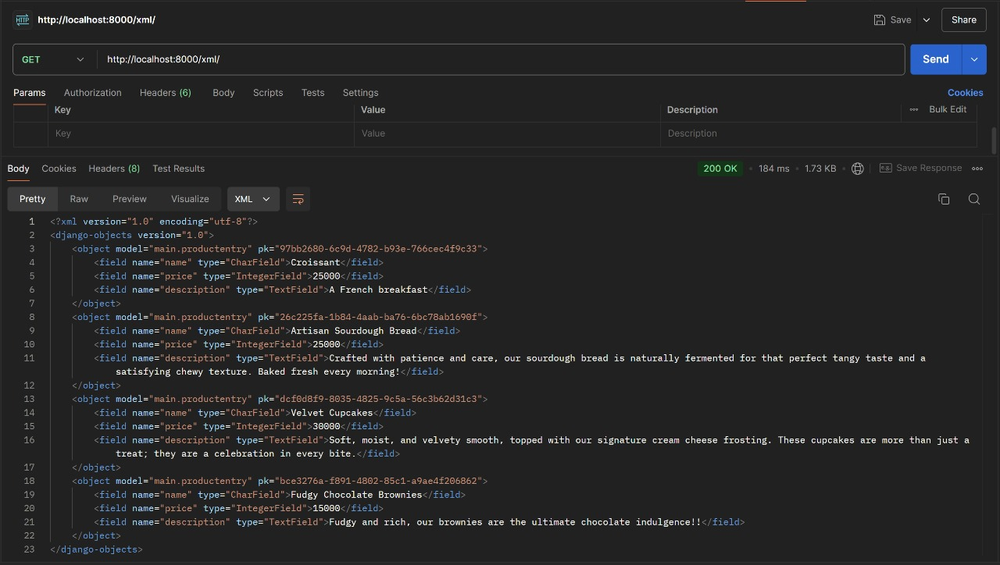
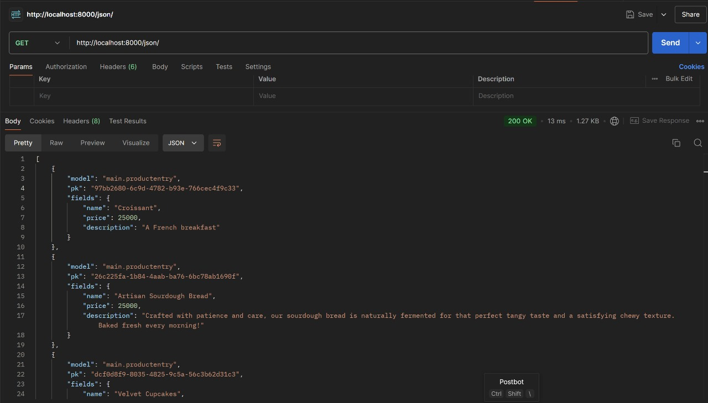
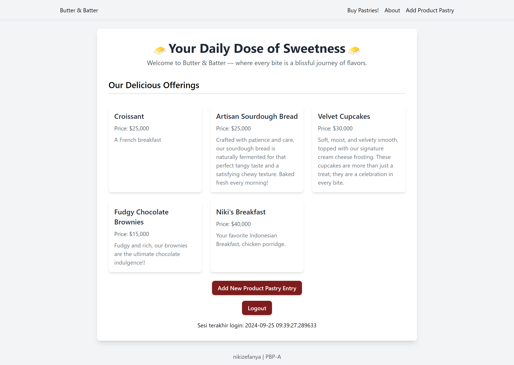

# 🧈 Butter & Batter 🧈

Patricia Herningtyas (2306152241)
PBP - A

🍰 Need some daily dose of sweetness? [Click Here](http://patricia-herningtyas-butterandbatter.pbp.cs.ui.ac.id/)

# TUGAS INDIVIDU 2

## Cara Pengimplementasian Secara Step-by-Step 

Pertama-tama, nyalakan virtual environment.

1) Membuat sebuah proyek Django baru
    - Membuat direktori lokal baru dengan nama butter-and-batter lalu menjalankan virtual environment di dalamnya.
    - Membuat berkas requirements.txt berisikan dependencies dan menginstallnya. Setelah itu, menjalankan perintah 'django-admin startproject butter_and_batter .' yang akan membuat folder butter-and-batter berisi konfigurasi dasar untuk projek Django.
    - Menambahkan localhost ke dalam ALLOWED_HOSTS lalu menjalankan server Django pada direktori lokal.
    - Membuat repositori GitHub butter-and-batter. Setelah itu, menginisiasi direktori lokal butter-and-batter sebagai repositori Git.
    - Menambahkan file .gitignore ke dalam repositori lokal lalu mempush semua perubahan pada repositori lokal ke repositori github.
    
2) Membuat aplikasi dengan nama main pada proyek tersebut
    - Membuat aplikasi baru dengan nama main dalam direktori proyek butter_and_batter dengan menjalankan perintah 'python manage.py startapp main' yang akan membuat membuat folder main yang berisi berkas-berkas dasar untuk aplikasi Django seperti views.py, models.py, dan urls.py.
    - Membuka settings.py di folder proyek, lalu tambahkan 'main' ke dalam daftar INSTALLED_APP agar Django mengenali aplikasi baru.

3) Melakukan routing pada proyek agar dapat menjalankan aplikasi main.
    - Mengimpor fungsi include dari django.urls.
    - Menambahkan rute URL path('', include('main.urls')) untuk mengarahkan ke tampilan main di dalam variabel urlpatterns.

4) Membuat model pada aplikasi main dengan nama Product dan memiliki atribut wajib sebagai berikut.
name, price, description
    - Mengisi berkas model.py dalam aplikasi main dengan model dengan atribut atau field yang memiliki tipe data masing-masing. Untuk name, tipe datanya adalah CharField, untuk price, tipe datanya, IntegerField. Untuk description, tipe datanya TextField.

5) Membuat sebuah fungsi pada views.py untuk dikembalikan ke dalam sebuah template HTML yang menampilkan nama aplikasi serta nama dan kelas kamu.
    - Membuka berkas views.py yang terletak di dalam berkas aplikasi main.
    - Mengimport render dari django.shortcuts. Menambahkan fungsi show_main yang berisi context.
    - Memasukan return render(request, "main.html", context) yang berguna untuk me-render tampilan main.html dengan menggunakan fungsi render
    - Membuka berkas main.html dan mengubah nama dan kelas menjadi struktur kode Django yang sesuai untuk menampilkan data (template variables)

6) Membuat sebuah routing pada urls.py aplikasi main untuk memetakan fungsi yang telah dibuat pada views.py.
    - Untuk membuat routing pada urls.py di aplikasi Django, perlu memetakan URL ke fungsi di views.py menggunakan fungsi path(). Misalnya, path('',views.home, name='home') memetakan URL root ke fungsi home di views.py, sehingga saat URL tersebut diakses, fungsi yang sesuai akan dijalankan.

7) Melakukan deployment ke PWS terhadap aplikasi yang sudah dibuat
    - Membuat new project di PWS dengan nama butterandbatter kemudian menambahkan URL deployment "patricia-herningtyas-butterandbatter.pbp.cs.ui.ac.id" pada ALLOWED_HOST dalam settings.py sesuai username dan nama proyek di repositori lokal.
    - Menjalankan Project Command pada halaman PWS lalu mengubah nama branch menjadi main.
    - Mempush perubahan pada repositori lokal ke PWS dengan menjalankan perintah 'git push pws main:master'.

8) Membuat file README.md
    - Buatlah file baru dengan nama README.md di direktori utama proyek.
    - Mengedit file README.md untuk keterangan dan sesuai kebutuhan

Semua perubahan yang telah dibuat, tidak lupa untuk di git add, commit, dan push ke github dan push ke PWS. Jika sudah selesai mengerjakan, matikan virtual environment.

## Bagan Request Client ke Web Aplikasi Berbasis Django dan Responnya 

Permintaan dari client pertama kali diproses oleh `urls.py`, yang akan mencocokkan URL tersebut dengan fungsi view yang sesuai di `views.py`. Di dalam `views.py`, logika aplikasi dieksekusi dan jika memerlukan data dari database, fungsi view akan memanggil model yang ada di `models.py`. Setelah data berhasil diambil, view akan mempersiapkan template HTML dengan data tersebut dan merendernya. Hasil akhirnya adalah halaman web atau respons JSON yang dikirim kembali ke browser client.

## Fungsi Git dalam Pengembangan Perangkat Lunak 
Git adalah sistem kontrol versi yang membantu developer melacak perubahan kode sumber, berkolaborasi, dan mengelola versi proyek selama pengembangan perangkat lunak. Beberapa fungsi git diantaranya:
1. Memungkinkan developer untuk bekerja secara bersamaan pada proyek yang sama di laptop/mesin lokal mereka tanpa saling mengganggu pekerjaan masing-masing.
2. Branching yang memungkinkan developer untuk membuat cabang (branch) terpisah dari proyek utama dan merging untuk (merge) menggabungkan kembali cabang tersebut ke cabang utama. Hal ini dilakukan untuk menghindari konflik.
3. Menyimpan berbagai versi dari sebuah proyek sebagai "commit" yang dapat mengurangi resiko kehilangan pekerjaan yang sudah dibuat.
4. Dengan adanya fitur commit dan log, git menyediakan catatan lengkap dari siapa yang mengubah apa, kapan, dan mengapa, melalui 
5. Mendeteksi konflik ketika dua developer melakukan perubahan pada bagian kode yang sama dan meminta developer untuk menyelesaikannya

## Mengapa Framework Django Dijadikan Permulaan Pembelajaran Pengembangan Perangkat Lunak? 
Django menggunakan arsitektur Model-View-Template (MVT) yang memfasilitasi pemisahan antara logika aplikasi, data, dan tampilan secara jelas. Django juga mempunyai berbagai fitur siap pakai, seperti autentikasi pengguna, URL routing, ORM (Object-Relational Mapping), dan lainnya. Hal ini sangat membantu developer pemula karena mereka tidak perlu membangun semuanya dari awal.


## Mengapa model pada Django disebut sebagai ORM? 
Model Django disebut sebagai ORM karena memungkinkan interaksi dengan database menggunakan bahasa Python, tanpa perlu menulis query SQL secara langsung. Django ORM secara otomatis mengubah model Python menjadi tabel database, sehingga memudahkan pengelolaan data dan mengurangi risiko kesalahan yang terjadi saat menulis query SQL secara manual.

# TUGAS INDIVIDU 3

## Data delivery dalam pengimplementasian sebuah platform
Data delivery mengoptimalkan performa platform dengan mengurangi waktu muat dan bandwidth, memungkinkan pengolahan data real-time, serta mendukung keamanan dan kontrol akses data melalui enkripsi dan autentikasi. Selain itu, data delivery juga memungkinkan platform untuk menangani pertumbuhan pengguna dan volume data.

## XML vs JSON
Menurut saya, JSON lebih baik dibandingkan XML karena lebih readable. Melalu pencaharian lebih lanjut, JSON ternyata memang lebih populer dibandingkan XML.
- Parsing dan serialisasi JSON lebih cepat dan lebih efisien karena banyak bahasa pemrograman memiliki dukungan built-in atau library yang efisien untuk menangani JSON.
- Sintaks JSON mirip dengan bahasa pemrograman modern dan formatnya hanya terdiri dari objek dan array sehingga lebih mudah dibaca. Sedangkan, sintaks XML lebih kompleks dengan tag pembuka dan penutup, atribut, dan hierarki yang lebih rumit.
- Selain itu, format JSON merupakan subset dari objek JavaScript yang memudahkan pengolahan data JSON langsung dari browser. Jika menggunakam XML, dibutuhkan parsing tambahan (pembacaan dan interpretasi data)

## Fungsi dari method is_Valid() pada form Django
Untuk memeriksa apakah data yang diterima dari pengguna (misalnya, melalui form HTML) sesuai dengan aturan dan batasan yang telah ditetapkan dalam definisi form tersebut.

## Fungsi csrf_token saat membuat form di Django
Agar aplikasi web terlindungi dari serangan CSRF (Cross-Site Request Forgery) CSRF, kita harus menambahkan csrf_token. CSRF adalah jenis serangan di mana penyerang memanipulasi akses autentikasi pengguna untuk melakukan tindakan yang tidak diinginkan pada aplikasi web yang mereka akses.

Token csrf_token dibuat oleh server dan dimasukkan ke dalam setiap form HTML. Saat seseorang melakukan permintaan POST atau tindakan yang mengubah data, token ini dikirim kembali ke server untuk memastikan bahwa permintaan tersebut berasal dari pengguna yang sah dan bukan dari penyerang.

Penyerang dapat memanfaatkan kerentanan CSRF untuk membuat permintaan berbahaya kepada aplikasi web dengan menggunakan formulir atau skrip yang disembunyikan di situs web lain, dan jika pengguna yang sah sedang login, penyerang dapat membuat permintaan palsu yang memanfaatkan kredensial yang sudah ada pada aplikasi jika csrf_token tidak ditambahkan.

## Step-by-step Pengimplementasian
Membuat input form untuk menambahkan objek model pada app sebelumnya.

1. Membuat form (forms.py) dengan model ProductEntry dengan field untuk menerima data Product baru
    - Menambahkan fungsi create_product_entry(views.py) yang mengarahkan pengguna dari halaman utama ke halaman input kemudian memvalidasi, memproses, dan menyimpan input. Setelah input berhasil disimpan, pendapat akan diarahkan kembali ke halaman utama (redirect).
    - Menambahkan product_entries = Product.objects.all() pada fungsi show_main (views.py) agar input yang berhasil diterima ditampilkan ketika pengguna diarahkan kembali ke halaman utama
    - Membuat HTML baru (create_mood_entry.html) untuk menampilkan form input
    - URL Routing form input dengan menambahkan path URL ke dalam urlpatterns (urls.py)
    
2. Tambahkan 4 fungsi views baru untuk melihat objek yang sudah ditambahkan dalam format XML, JSON, XML by ID, dan JSON by ID.
    - Mengimport HttpResponse dan Serializer pada views.py
    - Menambahkan 4 fungsi untuk view dengan format JSON dan XML di views.py (show_xml, show_json, show_xml_by_id, dan show_json_by_id)

3. Membuat routing URL untuk masing-masing views yang telah ditambahkan pada poin 2
    - Meng-import keempat fungsi view yang sudah dibuat pada poin 2 ke dalam urls.py.
    - Menambahkan path URL masing-masing view ke dalam urlpatterns (urls.py)


## XML


## JSON



## XML by ID


## JSON by ID


# TUGAS INDIVIDU 4
## Perbedaan antara `HttpResponseRedirect()` dan `redirect()`
### `HttpResponseRedirect()` :
Ini adalah kelas di Django yang digunakan untuk mengembalikan HTTP redirect response ke URL yang ditentukan. URL tujuan perlu dimasukkan secara manual, seperti `HttpResponseRedirect('/some-url/')`

### `redirect()` :
`redirect()` adalah shortcut function yang lebih mudah digunakan dibanding HttpResponseRedirect. Ini bisa menerima model, view, atau url sebagai argumen, dan akan secara otomatis menangani pembuatan URL untuk redirect (lebih fleksibel).

## Cara Kerja Penghubungan Model `Product` dan `User`
Penghubungan model Product dengan User dilakukan dengan menggunakan ForeignKey. Langkah-langkahnya adalah sebagai berikut:
1. Membuat Model Product:
    - Tambahkan ForeignKey ke model User dalam model Product untuk menunjukkan bahwa setiap produk memiliki pemilik (user).
    - `user = models.ForeignKey(User, on_delete=models.CASCADE)`:
        - Ini menghubungkan Product dengan User menggunakan ForeignKey.
        - `on_delete=models.CASCADE` berarti ketika user dihapus, semua produk yang terkait dengan user tersebut juga akan dihapus.
2. Mengubah fungsi `create_product_entry` pada `views.py`:
    `product_entry = form.save(commit=False)`
    `product_entry.user = request.user`
    `product_entry.save()`
    
    Parameter commit=False yang digunakan pada potongan kode diatas berguna untuk mencegah Django agar tidak langsung menyimpan objek yang telah dibuat dari form langsung ke database.

    Hal tersebut memungkinkan kita untuk memodifikasi terlebih dahulu objek tersebut sebelum disimpan ke database. Pada kasus ini, kita akan mengisi field user dengan objek User dari return value `request.user` yang sedang terotorisasi untuk menandakan bahwa objek tersebut dimiliki oleh pengguna yang sedang login.

3. Mengubah product_entries dan context pada fungsi show_main:
    `product_entries = ProductEntry.objects.filter(user=request.user)`
    `context = {'name': request.user.username,...}`
    
    Kode tersebut berfungsi untuk menampilkan objek Product Entry yang terasosiasikan dengan pengguna yang sedang login. Hal tersebut dilakukan dengan menyaring seluruh objek dengan hanya mengambil Product Entry yang dimana field user terisi dengan objek User yang sama dengan pengguna yang sedang login.

    Kode `request.user.username` berfungsi untuk menampilkan username pengguna yang login pada halaman main.

4. Menyimpan semua perubahan dan melakukan migrasi model dengan `python manage.py migrations` dan `python manage.py migrate`

5. Mempersiapkan aplikasi web untuk environment production dengan menambahkan sebuah import baru pada `settings.py` yang ada pada subdirektori `butter_and_batter`:
    `import os`
    
    Kemudian mengganti variabel `DEBUG` dari berkas `settings.py`:
    `PRODUCTION = os.getenv("PRODUCTION", False)`
    `DEBUG = not PRODUCTION`

6. Selesai! jalankan proyek Django dengan `python manage.py runserver` dan buka http://localhost:8000/

## Perbedaan _authentication_ dan _authorization_, dan Implementasinya di Django
*Authentication:*
Proses untuk memverifikasi identitas pengguna. Ini biasanya melibatkan login dengan nama pengguna dan kata sandi.
Di Django, ini diimplementasikan menggunakan sistem user dan password hashing yang aman. Proses otentikasi terjadi ketika pengguna memasukkan kredensial login.

*Implementasi Authentication:*
Menambahkan fungsi `login_user` dalam `views.py`:
```
def login_user(request):
   if request.method == 'POST':
      form = AuthenticationForm(data=request.POST)

      if form.is_valid():
            user = form.get_user()
            login(request, user)
            return redirect('main:show_main')

   else:
      form = AuthenticationForm(request)
   context = {'form': form}
   return render(request, 'login.html', context)
```
`login(request, user)` berfungsi untuk melakukan login terlebih dahulu. Jika pengguna valid, fungsi ini akan membuat session untuk pengguna yang berhasil login.

*Authorization:*
Setelah pengguna terotentikasi, otorisasi menentukan apa yang boleh atau tidak boleh dilakukan oleh pengguna tersebut. Ini berkaitan dengan izin (permissions).

## Cara Django Mengingat Pengguna yang Telah Login dan Pengguna Cookies
Django menggunakan session ID dan cookies. Ketika login, session ID akan disimpan. Cookies dapat menyimpan preferensi pengguna, menyimpan data sementara, dan juga dapat melacak aktivitas pengguna di situs untuk keperluan analisis. Tidak semua cookies aman digunakan, ada kasus dimana cookies berisi informasi sensitif seperti password namun tidak dienkripsi sehingga cookies ini memiliki kemungkinan untuk bisa diakses melalui JavaScript oleh pihak ketiga.

## Pengimplementasian Checklist Secara Step-by-Step
1. Mengimplementasikan fungsi registrasi, login, dan logout.
    - Membuat login html dan register html dengan form dan methodnya adalah post
    - Membuat fungsi registrer di views.py yang memanggil UserCreationForm() dan menyimpan form yang akan pindah ke page login.
    - Membuat fungsi user_login yang memanggil AuthenticationForm(data=request.POST) yang akan men-get user kemudian akan menyimpan cookie dan mengarahkan user ke front page
    - Membuat fungsi logout_user untuk menghapus cookie sebelumnya dan mengarahkan ke page login.
    - Mengimport semua fungsi views lalu membuat path untuk setiap fungsinya.

2. Membuat dua akun pengguna dengan masing-masing tiga dummy data
    - Melakukan registrasi 2 akun pada page register/ kemudian login dan menambahkan 3 data pada page create-product-entry/ untuk masing-masing akun tersebut.
    
    

3. Menghubungkan model Product dengan User
    - Menambahkan kode `user = models.ForeignKey(User, on_delete=models.CASCADE)` dalam class Product di models.py (menggunakan ForeignKey)
    - Melakukan migrasi model ke database dengan `python manage.py makemigrations` dan `python manage.py migrate`.

4. Menampilkan detail informasi pengguna yang sedang logged in seperti username dan menerapkan cookies seperti last login pada halaman utama aplikasi.
    - Memastikan pengguna sudah login sebelum bisa mengakses halaman utama dengan menambahkan login_required decorator di view yang menampilkan halaman utama.
    - Mengambil data pengguna yang sedang login menggunakan `request.user`
    - Setel cookie last login saat pengguna login, dan tampilkan di halaman utama `'last_login': request.COOKIES['last_login'],`

5. Menjawab beberapa pertanyaan berikut pada README.md
    - Memodifikasi README.md yang sudah dibuat sebelumnya


# TUGAS INDIVIDU 5
 ## Jika terdapat beberapa CSS selector untuk suatu elemen HTML, jelaskan urutan prioritas pengambilan CSS selector tersebut!
 
 ## Mengapa responsive design menjadi konsep yang penting dalam pengembangan aplikasi web? Berikan contoh aplikasi yang sudah dan belum menerapkan responsive design!
 
 ## Jelaskan perbedaan antara margin, border, dan padding, serta cara untuk mengimplementasikan ketiga hal tersebut!
 
 ## Jelaskan konsep flex box dan grid layout beserta kegunaannya!
 
 ## Jelaskan bagaimana cara kamu mengimplementasikan checklist di atas secara step-by-step (bukan hanya sekadar mengikuti tutorial)!


